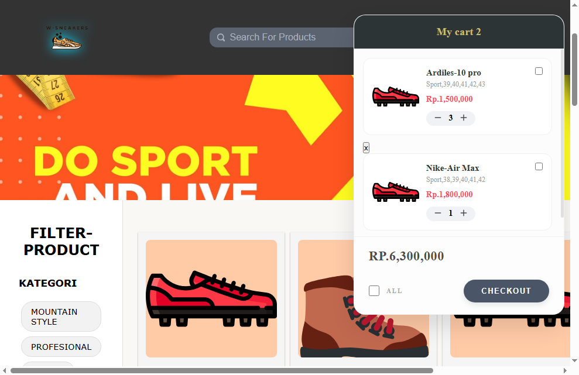

# 👟 W-Shoes — Simple Shoe E-Commerce

> Toko sepatu online sederhana berbasis web, dibangun dengan HTML, CSS, dan JavaScript murni tanpa framework.

---

## 🖼️ Preview

> 

---

## ✨ Fitur

- 🏠 Banner hero di halaman utama
- 👟 Katalog produk lengkap
- 🔍 Filter produk berdasarkan **kategori**, **harga**, dan **ukuran**
- 🛒 Keranjang belanja (cart)
- ⭐ Review dari pengguna

---

## 🛠️ Teknologi

- HTML5
- CSS3
- JavaScript (Vanilla)

---

## 📁 Struktur Proyek

```
W-Shoes_ECOMMERCE/
├── asset/           # Gambar produk dan aset visual
├── script.js        # Logika utama (filter, cart, review)
├── style.css        # Styling keseluruhan halaman
├── index.html       # Halaman utama
├── package.json
└── package-lock.json
```

---

## 🚀 Cara Menjalankan

**Tanpa instalasi** — cukup buka `index.html` di browser.

Atau kalau mau pakai live server:

```bash
# Install dependensi (jika ada)
npm install

# Jalankan dengan live-server
npx live-server
```

---

## 📄 Lisensi

Proyek ini dibuat untuk keperluan pribadi / pembelajaran.
